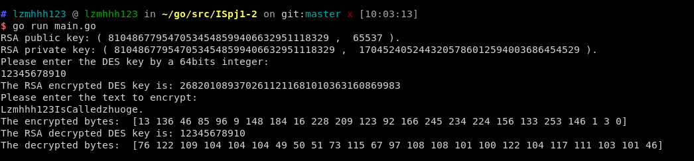

# RSA_DES
Project of Information Security 1-2(RSA &amp; DES : encryption &amp; decryption)

Inplement of 128bits of RSA keys generation. Combined DES algorithm to encrypt and decrypt.

### Dependence
- [Go](https://golang.org/)

### Usage
```
cd $GOPATH
git clone https://github.com/lzmhhh123/RSA_DES
cd RSA_DES
go run main.go
```
### Report
*encryption & decryption experiment result:*

